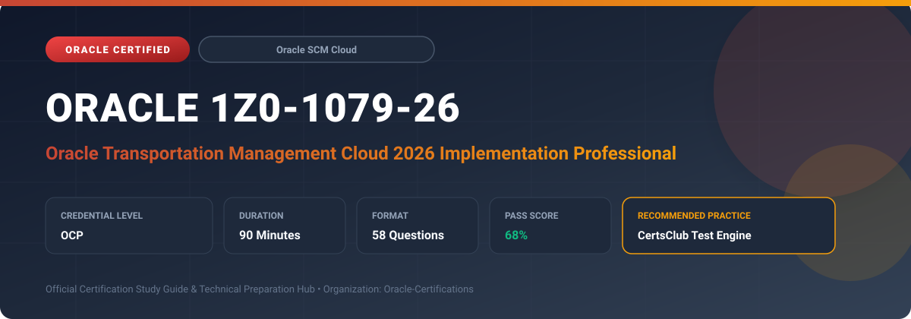

  

# Oracle 1Z0-1079-26: Oracle Transportation Management Cloud 2026 Implementation Professional

---

## 1. Exam Overview & Candidate Profile

The **Oracle 1Z0-1079-26: Oracle Transportation Management Cloud 2026 Implementation Professional** examination is engineered for enterprise architects, solution specialists, functional consultants, and implementation professionals seeking formal industry recognition of their proficiency in Oracle technologies.

The Oracle Transportation Management Cloud 2026 Implementation Professional (1Z0-1079-26) certification verifies comprehensive knowledge in configuring OTM Cloud solutions. It certifies skills in shipment optimization, automated tendering, fleet routing, tracking visibility, and end-to-end transportation financial settlement.

### Target Audience & Prerequisites
- **Target Roles**: Implementation Specialists, Cloud Architects, Technical Leads, Enterprise Functional Consultants, and Systems Engineers.
- **Recommended Experience**: 1–2 years of practical, hands-on experience designing, implementing, and maintaining corresponding Oracle Cloud solutions.
- **Credential Earned**: Oracle Certified Professional (OCP).

---

## 2. Key Exam Specifications

| Specification | Details |
| :--- | :--- |
| **Exam Code** | **Oracle 1Z0-1079-26** |
| **Official Title** | Oracle Transportation Management Cloud 2026 Implementation Professional |
| **Certification Track** | Oracle Supply Chain Management Cloud |
| **Exam Duration** | 90 Minutes |
| **Number of Questions** | 58 Questions |
| **Passing Score** | 68% |
| **Question Format** | Multiple Choice (Single/Multiple Answer), Scenario-Based Questions |
| **Delivery Provider** | Oracle University / Pearson VUE (Online Proctored or Test Center) |
| **Recommended Practice Engine** | [CertsClub Oracle Practice Tests](https://www.certsclub.com/oracle/1z0-1079-26-dumps.html) |

---

## 3. Official Blueprint & Exam Domain Breakdown

The examination assesses candidate competencies across core functional domains weighted as follows:

| Domain Area | Weighting |
| :--- | :--- |
| **OTM Architecture, Domain Setup & User Access** | `20%` |
| **Order Management & Operational Planning** | `25%` |
| **Rate Management, Distance Engines & Itineraries** | `20%` |
| **Carrier Tendering, Tracking & Event Management** | `15%` |
| **Freight Settlement, Invoicing & Financial Auditing** | `20%` |

---

## 4. Deep Dive into Complex & Challenging Technical Topics

To secure a passing score on the 1Z0-1079-26 exam, candidates must master the following advanced concepts:

- Tuning 3D load configuration, equipment group definitions, and axle weight limits in OTM.
- Configuring automated sequential and broadcast tendering workflows, response time windows, and carrier fallbacks.
- Implementing shipment tracking events, tracking milestones, exception management, and carrier status feeds.
- Designing complex freight cost allocations across line items and integrating shipping costs with SCM Cost Accounting.

---

## 5. Scenario-Based Demo & Practice Questions

### Question 1
Which tendering method in Oracle Transportation Management broadcasts a shipment tender to multiple service providers simultaneously, awarding the shipment to the first carrier that accepts?

A) Sequential Tendering
B) Broadcast Tendering
C) Manual Dispatch
D) Spot Bid Tendering

- **Correct Answer**: `B) Broadcast Tendering`  
- **Technical Explanation**: Broadcast tendering notifies a defined group of eligible service providers concurrently, awarding the tender to whichever carrier accepts first within the expiration window.

---

### Question 2
In OTM Rate Management, what is the role of a Rate Offering in relation to a Rate Record?

A) The Rate Offering contains specific origin-destination pricing, while the Rate Record defines the contract terms.
B) The Rate Offering establishes general contractual terms, service provider info, and rating rules, while the Rate Record stores specific geographical cost data.
C) The Rate Offering is used solely for ocean shipments, while Rate Records are for domestic rail.
D) The Rate Offering is generated only after invoice settlement.

- **Correct Answer**: `B) The Rate Offering establishes general contractual terms, service provider info, and rating rules, while the Rate Record stores specific geographical cost data.`  
- **Technical Explanation**: A Rate Offering acts as the contractual template defining the service provider, currency, rate type, and calculation logic. Rate Records associate specific origin/destination pairs and lane rates to that offering.

---

## 6. Recommended Preparation Strategy & Practice Testing Engine

Achieving certification in **Oracle 1Z0-1079-26** requires balanced theoretical study and scenario-based simulation practice:

1. **Review Oracle Documentation**: Master architecture guides, implementation workbooks, and administration manuals on the Oracle Help Center.
2. **Hands-on Lab Practice**: Execute real-world configuration, policy setup, and troubleshooting tasks in your cloud tenancy or test instance.
3. **Simulated Exam Drills**: Practice answering timed, scenario-based multiple-choice questions to familiarize yourself with the question formats, traps, and timing constraints.

### Practice With CertsClub
For realistic practice questions, updated dumps, and mock testing environments:
- **Resource**: [CertsClub Oracle Practice Test Engine](https://www.certsclub.com/oracle/1z0-1079-26-dumps.html)
- **Special Discount**: Use coupon code **`club20`** during checkout for an instant **20% discount** on all practice exam bundles and testing engines.

---

## 7. Official Documentation & References

- [Oracle University Certification Registry](https://education.oracle.com/)
- [Oracle Help Center Documentation Portal](https://docs.oracle.com/)
- [Oracle Cloud Infrastructure & Applications Guides](https://docs.oracle.com/en/cloud/)
- [CertsClub Oracle Certification Exam Practice](https://www.certsclub.com/oracle/1z0-1079-26-dumps.html)

---

## 8. SEO & Discovery Keywords

`oracle 1z0-1079-26, oracle 1z0-1079-26 exam, oracle 1z0-1079-26 dumps, 1Z0-1079-26 practice questions, 1Z0-1079-26 study guide, oracle 1z0-1079-26 syllabus, oracle transportation management cloud 2026 implementation professional, certsclub 1z0-1079-26`
